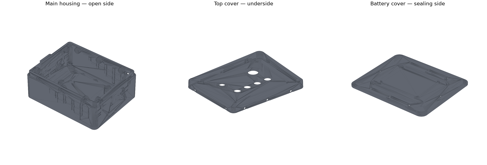

# RES 遥控端壳体最终生产与装配说明

版本：2026-07-30 R3（上盖侧向螺柱水平加强筋修正版）  
材料：黑色高韧性 SLA 树脂  
适用嵌件：**M4×外径5×长8 mm**、**M5×外径7×长8 mm**

> 重要：本模型不是按 M4×5×4 或 M5×6×6 设计。若实际收到的嵌件不是上述 L8 规格，先停止加工并修改盲孔深度。

## 1. 可交付文件

- `RES_MainHousing.CATPart/.stp/.stl`：主壳体。
- `RES_TopCover.CATPart/.stp/.stl`：上盖。
- `RES_BatteryCover.CATPart/.stp/.stl`：外置电池盖。
- `RES_InsulationPlate.CATPart/.stl`：168×130×2 mm FR-4 绝缘板加工参考，不建议用树脂代替。
- `RES_M4_InsertCoupon.CATPart/.stp/.stl`：M4 嵌件工艺试块，正式装嵌件前必须测试。
- `RES_TopGasket_3mm.CATPart/.stl`：3 mm 平面密封垫下料参考，不打印。
- `RES_HandleGasket_1mm.CATPart/.stl`：把手 EPDM 垫下料参考，不打印。
- `VALIDATION_REPORT.json`：三件壳体 STL 网格与材料估算报告。
- `BUILD_PARAMETERS.txt`：完整参数表。

## 2. 最终尺寸与容量复核

### 2.1 壳体和打印成本

| 项目 | 最终值 |
|---|---:|
| 主壳体本体 | 188×150×68 mm |
| 含两侧一体肩带环的主壳体最大包络 | 200×150×68 mm |
| 装配后打印件最大包络 | 200×150×79.3 mm |
| 主电子腔 | 180×142 mm |
| 上方装入口 | 170×132 mm |
| 三件树脂件几何体积 | 494.892 cm³ |
| 按树脂密度1.10 g/cm³估算 | 544.4 g |
| 按0.45元/g估算净件价格 | 约244.97元 |
| 加20%支撑/工艺余量估算 | 约293.96元 |

以上价格未包含运费、后处理溢价及工艺试块。为控制总价300元以内，下单时只把三件壳体作为计价打印件；试块要求商家用同批树脂随件排版或免费附打。密封垫参考件和绝缘板禁止按树脂件打印。

### 2.2 电池和电子模块

- 电池最大实物包络按 **70×56×20 mm** 校核；电池槽为 **74×60×23 mm**。
- 长、宽方向每侧有2 mm名义空间。贴1 mm闭孔EVA后，每侧仍约1 mm装配余量。
- 高度方向总余量3 mm；建议底部1 mm、盖侧1 mm泡棉，剩余1 mm用于误差及轻压紧。
- 绝缘板为168×130×2 mm，四个减震柱中心为X=±78、Y=±59 mm。
- 绝缘板底面Z=28 mm、顶面Z=30 mm；上盖装配后的内表面约Z=70.3 mm。

| 模块 | 板上最高点 | 至上盖内表面余量 |
|---|---:|---:|
| 四路继电器 | 约Z48.5 | 约21.8 mm |
| 两路继电器 | 约Z48.5 | 约21.8 mm |
| DCDC | 约Z41.4 | 约28.9 mm |
| LoRa+STM32连接基板，总叠层≤20 mm | ≤Z50 | ≥20.3 mm |

平面布局复核通过，但仍须实测急停触点块、LED和启动按钮的面板下深度。急停下方42×42 mm必须保持完全禁布；面板器件不能靠弯折端子强行避让模块。

### 2.3 减震行程

- 减震柱：M4×8、橡胶体D10×H10。
- 壳体减震柱座顶面Z=18 mm，M4孔为Ø5.1×8.5 mm盲孔，孔底以下仍有9.5 mm实体。
- 绝缘板左右边缘在Y=±32 mm处增加4个8×20 mm缺口，避开把手内侧凸台。减震柱压缩时不会形成刚性第五支点。
- 电池舱顶面可贴30×30×2 mm软闭孔泡棉，仅作极限位移缓冲，不得预压成硬支撑。

## 3. 嵌件和孔的最终定义

| 位置 | 嵌件 | 打印盲孔 | 导入口 | 名义盲底实体 |
|---|---|---|---|---:|
| 上盖侧向10处 | M4×D5×L8 | Ø5.1×8.5，自外圆台端面一次成孔 | 打印后手工轻倒角0.2～0.3 | 3.9 mm |
| 电池盖8处 | M4×D5×L8 | Ø5.1×8.5 | Ø5.6×0.5 | 3.5 mm |
| 减震柱4处 | M4×D5×L8 | Ø5.1×8.5 | Ø5.6×0.5 | 9.5 mm至壳底 |
| 两侧把手共4处 | M5×D7×L8 | Ø7.1×8.5 | Ø7.6×0.5 | 3.5 mm |

M4工艺试块从左到右为Ø4.9、Ø5.1、Ø5.3，深度均为8.5 mm。商家的Ø5.1是名义值，但批次收缩、后固化和打印方向会改变实际配合，所以必须用同批试块选孔。

上盖侧向10个螺柱中心为Z=60.5 mm，D14圆柱最高点为Z=67.5 mm，低于Z=68 mm主密封面0.5 mm。加强筋只沿壳壁水平方向展开：长边沿全局X、短边沿全局Y，尺寸为总跨24×厚3×入腔深5 mm，Z范围59～62 mm；不得再增加对称竖筋。

## 4. 打印下单要求

向商家发送以下要求：

1. 黑色高韧性SLA树脂，局部尺寸误差按±0.2 mm，大件翘曲不超过0.3 mm。
2. 主壳体开口向上或由商家选择可避免密封面支撑痕的方向；所有主密封平面、上盖止口、O形圈槽内禁止布置支撑点。
3. 上盖外表面、按钮密封台和侧裙不得有贯穿裂纹、缺口或未完全固化区域。
4. 电池盖O形圈槽、迷宫唇和主壳体对应槽不得喷砂过度。
5. M4试块与三件壳体同批打印、同批清洗、同批后固化。
6. 不让商家打印两种密封垫参考件；绝缘板另用2 mm FR-4加工。

## 5. 收货后的防水后处理

### 5.1 清洗、后固化和检查

1. 确认商家已完成清洗和后固化；若表面发黏、酒精味明显或指甲可留下深印，暂不装配。
2. 在室温放置24小时后再测量，避免刚后固化的尺寸漂移。
3. 用强光检查薄壁、肩带环根部、把手凸台、所有螺柱根部及密封唇，出现白化、裂纹或分层直接退件。
4. 用卡尺检查Ø5.1/Ø7.1孔、上盖包边间隙、电池盖迷宫配合；盖子应能手压到位，不得靠螺钉强拉纠偏。

### 5.2 密封面修整

1. 将600号砂纸固定在玻璃板上，轻磨主壳体上密封台、上盖对应压面和电池盖密封面。
2. 只消除打印纹和局部高点，不改变止口高度；每磨10次检查一次接触印迹。
3. 再用800～1000号砂纸收面。O形圈槽底只清除毛刺，禁止扩大槽宽或加深槽。
4. 用无水异丙醇擦净并完全挥发。不要让丙酮接触树脂。

### 5.3 树脂表面封闭

高韧性SLA为实心固化树脂，不是FDM网格结构，但微裂纹和局部欠固化仍可能形成渗水路径。建议：

- 对壳体外表面及内表面各薄涂1～2层双组份透明环氧封闭涂层或聚氨酯三防漆。
- 密封面、止口、O形圈槽、螺纹、按钮孔和SMA孔必须遮蔽，不能靠涂层补尺寸。
- 每层完全固化后再涂下一层；不能用酸性玻璃胶，局部二次密封只用中性RTV或电子级中性硅橡胶。
- 国内采购搜索词：`双组份透明环氧封闭胶`、`聚氨酯PCB三防漆`、`中性RTV电子密封胶`、`O型圈硅脂`。

## 6. 嵌件安装

黑色SLA是热固性材料，不能像FDM塑料那样用200 ℃烙铁熔入。可使用机械工程师所说的“热辅助嵌入”，但温度只用于降低局部阻力，不是熔化树脂。

1. 先在M4试块上测试Ø4.9、Ø5.1、Ø5.3孔。选不白化、不裂、可保持垂直且不需要大力压入的最小孔。
2. 若商家材料没有明确热嵌温度，优先采用常温/低温压入加韧性环氧胶。不得直接把烙铁设为200 ℃。
3. 黄铜嵌件外表面用异丙醇除油并轻微拉毛；螺纹内预先旋入涂有脱模蜡的临时螺钉，防止进胶。
4. 在孔壁下半段点极少量双组份韧性环氧胶，不把盲孔完全灌满；0.5 mm孔底余量用于容纳胶和空气。
5. 用钻床、压机或垂直导向夹具慢速压入，使嵌件端面低于表面0～0.2 mm。禁止用锤敲。
6. 完全固化后取出临时螺钉，清理螺纹，并在试块上做扭矩试验后再安装壳体全部嵌件。

## 7. 密封件

### 7.1 上盖

- 使用一整片3 mm闭孔硅胶平垫，外形179×141 mm、内孔171×133 mm。
- 盖裙肩部把垫片压到2.3 mm，名义压缩率约23%。不得把垫片剪成四条后拼角。
- 10颗侧向M4×8密封螺钉位于主密封之外；螺钉头下仍放配套小O形圈。

### 7.2 电池盖

- 使用已购NBR **ID100×2.5 mm** O形圈，薄涂硅脂后装入3.4 mm宽、1.9 mm深槽。
- 先确认O形圈无扭转，再让外侧迷宫唇进入对应槽。
- 8颗M4×8螺钉使用头下小O形圈；螺孔位于主O形圈外，嵌件盲孔不通电池腔。

### 7.3 把手、按钮、LED和SMA

- 把手：每侧使用一整片71×36×1 mm闭孔EPDM垫，不使用已购ID60×2.5 O形圈。把手螺钉长度按“把手实际安装耳厚度+1 mm垫片+5～6 mm有效啮合”选取，不能顶到M5盲孔底。
- 肩带环：壳体一体成形，无穿墙孔，不需另打孔；使用20～25 mm织带软环连接。
- 急停：Ø22.4 mm孔，使用器件原厂面板密封圈。
- LED：Ø16.4 mm孔。已购ID20×1 O形圈仅在灯体法兰外径≥23 mm且能均匀压紧时使用，否则用灯具原配垫圈。
- 启动按钮：Ø13.8 mm孔，使用按钮自带密封垫。
- SMA-K：前侧Ø10.4 mm孔、M10×1母座。使用母座自带O形圈和防松垫片；壳外O形圈为主密封，壳内螺母紧固后可在螺纹出口点一圈极薄中性RTV作二级密封。

## 8. 内部布局和布线

以绝缘板中心为X0/Y0，+Y为SMA前侧：

| 模块 | 推荐中心X,Y / mm | 占用范围X / mm | 占用范围Y / mm |
|---|---:|---:|---:|
| Relay_4 | -31.5, 35 | -69～6 | 7.5～62.5 |
| Relay_2 | -17, -17 | -37.5～3.5 | -33.5～-0.5 |
| INA226 | -64, -20 | -74～-54 | -33.5～-6.5 |
| DCDC | -40, -50 | -69.75～-10.25 | -62.9～-37.1 |
| STM32 | 26.835, 43.585 | 13.5～40.17 | 25.17～62 |
| LoRa | 57.37, 35.5 | 43.37～71.37 | 9～62 |

LoRa和STM32安装在约62×57×1.6 mm连接基板上，基板范围X=12～74、Y=7～64。右上角对X=78/Y=59的减震柱做R4.8开口缺口。LoRa射频端朝+Y，连接SMA的同轴线弯曲半径不小于15 mm。

布线规则：

1. DCDC、12 V和继电器功率线沿左侧/下侧走；LoRa、SPI/UART和天线线沿右侧/上侧走。
2. 射频/通信线与继电器线、DCDC电感区保持至少10 mm；无法满足时只允许近似垂直交叉。
3. 每条飞线留10～15 mm柔性服务环，并用粘贴式扎带座或绝缘压线夹做应力释放。
4. 同轴线不得承担LoRa模块固定力；连接基板用3～4个M2.5尼龙隔离柱机械固定。
5. 继电器等重模块不得只靠泡棉双面胶，可使用尼龙螺柱或板上压条。

## 9. 装配顺序

1. 完成壳体后固化、尺寸检查、密封面修整和表面封闭。
2. 用试块确定嵌件工艺，安装全部M4/M5嵌件并等待胶完全固化。
3. 安装两侧把手及EPDM整面垫，先轻压定位，不立即达到最终扭矩。
4. 将4个D10×H10减震柱旋入壳体M4嵌件。
5. 在绝缘板对角孔穿两根临时长M4螺钉或扎带作为提手，将空板从170×132开口放入。
6. 按“基准圆孔→X释放槽→Y释放槽→D6浮动孔”顺序装板；确认四个8×20缺口正对把手凸台。
7. 先装空的LoRa/STM32连接基板，再装STM32、LoRa和同轴线，然后安装继电器、DCDC、INA226及线束。
8. 安装上盖上的急停、LED、启动按钮和SMA，完成飞线；检查急停禁布区和同轴弯曲半径。
9. 装电池EVA垫、电池和线束，确认电池线不跨O形圈槽、不被电池盖夹住。
10. 进行通电功能测试后再装密封件和两块盖板。

## 10. 紧固与防水测试

### 10.1 紧固

- M4盖板螺钉先按对角/中心向两端分3轮紧固，初始建议0.30～0.40 N·m；只有试块扭矩试验通过后才可提高，建议上限0.50 N·m。
- M5把手螺钉初始建议0.6～0.8 N·m，并以把手不松动、EPDM均匀压缩为准；禁止用大扭矩补偿翘曲。
- 不使用可能侵蚀树脂的厌氧螺纹胶。需要防松时用机械防松垫片、头下O形圈和扭矩标记漆。

### 10.2 无电子件防水试验

1. 第一次测试不装电池和电子模块，在腔内铺干燥纸巾。
2. 合盖后从各方向用低压喷水10分钟，重点覆盖上盖周边、按钮、LED、SMA、把手和电池盖。
3. 静置10分钟再开盖；任何纸巾湿点都必须先定位处理，不能直接装电子件。
4. 通过喷水试验后进行肩带提拉、把手往复、轻度振动，再重复喷水。
5. 本结构目标是赛事雨淋和泼水防护；未经专门浸水验证，不宣称可长期浸没。

## 11. 最终验收结论

- 三件生产STL均为闭合水密网格：0退化三角形、0非流形/开边。
- CATIA原始STL在4个短边侧孔处出现几何重合但边划分为1对2的T形三角化；生产版`RES_MainHousing.stl`仅将4个长边各拆成2个三角形，没有移动顶点或改变尺寸、体积。CATPart和STEP始终是尺寸主文件。
- M4、M5全部为盲孔；孔底实体和根部加强筋满足本版装配条件。
- 主密封、螺钉密封、把手密封、SMA/按钮密封均具有明确结构或后处理方案。
- LoRa与STM32保持紧邻，62×57 mm连接基板可安装；模块平面与高度容量通过。
- 绝缘板新增把手凸台避让缺口后，减震柱压缩不会使板边硬碰凸台。
- 净件估算成本约244.97元；含约20%工艺余量约293.96元，满足300元目标的余量较小，必须按本文件的“只打印三件壳体、试块随件排版”方式询价。

最终放行条件：收到的嵌件确认为M4×D5×L8和M5×D7×L8；同批试块、盖子试装、喷水测试三项均通过。
