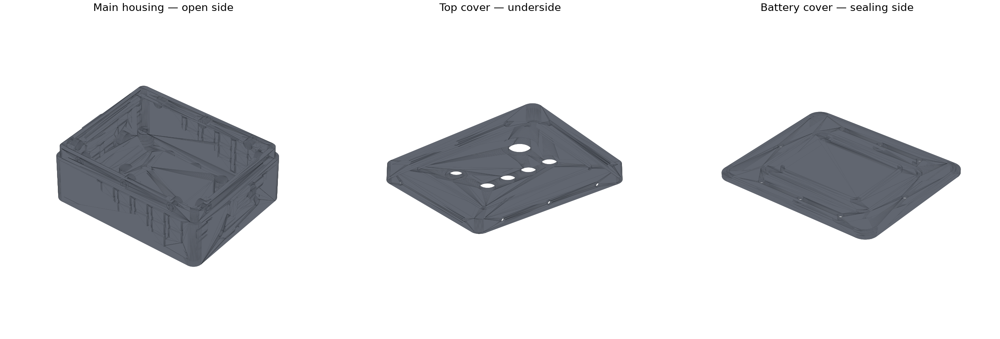
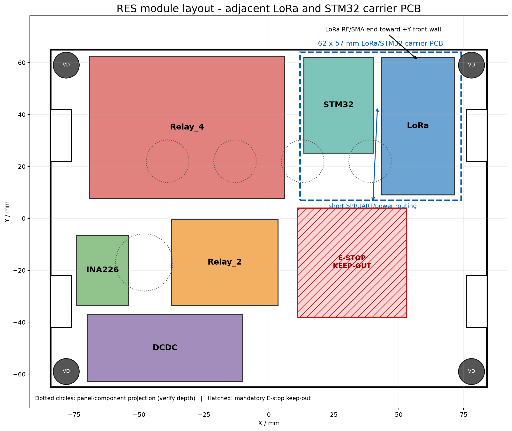

# RES 遥控端壳体生产与装配说明

版本：2026-07-30 R5（上盖孔下余厚增强版）  
材料：黑色高韧性 SLA 树脂，局部尺寸公差按 ±0.2 mm 设计  
适用嵌件：M4×外径5×长8 mm、M5×外径7×长8 mm

> R5 替代 R4。最重要的变化是主壳体上颈由 10 mm 加高到 13 mm，上盖包边由 12.3 mm 加深到 15.3 mm。上盖侧向螺栓孔下方的名义实体厚度由 1.5/1.7 mm 增加到 4.5/4.7 mm；计入 ±0.2 mm 加工误差后，最不利仍不小于 4.3 mm。

## 1. 交付与下单文件

- `RES_MainHousing.CATPart/.stp/.stl`：主壳体。
- `RES_TopCover.CATPart/.stp/.stl`：上盖。
- `RES_BatteryCover.CATPart/.stp/.stl`：电池盖。
- `RES_InsulationPlate.CATPart/.stl`：168×130×2 mm 绝缘板参考；正式件用 2 mm FR-4，不用树脂打印。
- `RES_M4_InsertCoupon.CATPart/.stp/.stl`：M4 嵌件试块，必须与壳体同批打印、清洗和后固化。
- `RES_TopGasket_3mm.CATPart/.stl`、`RES_HandleGasket_1mm.CATPart/.stl`：密封垫下料参考，不作为树脂打印件。
- `BUILD_PARAMETERS.txt`：完整结构参数。
- `VALIDATION_REPORT.json`：生产 STL 网格、体积、质量和成本校验。

## 2. 最终尺寸、容量和成本

| 项目 | R5 数值 |
|---|---:|
| 主壳体本体 | 188×150×68 mm |
| 含一体肩带环的平面包络 | 200×150 mm |
| 装配后最大打印件包络 | 200×150×79.3 mm |
| 主电子腔 | 180×142 mm |
| 顶部装入口 | 170×132 mm |
| 绝缘板 | 168×130×2 mm |
| 电池槽内部 | 74×60×23 mm |
| 可容纳电池 | 不大于 70×56×20 mm |
| 三件壳体总体积 | 499.289 cm³ |
| 按 1.10 g/cm³ 估算质量 | 549.2 g |
| 按 0.45 元/g 估算净件价 | 247.14 元 |
| 加 20% 工艺余量 | 约 296.57 元 |

为保持 300 元目标，下单时仅将主壳体、上盖和电池盖作为计价打印件；试块要求同批搭版，密封垫和绝缘板不要用树脂打印。报价若包含高额支撑/后处理费，应要求商家重新排版报价。

模块安装板底面 Z=28 mm、顶面 Z=30 mm；上盖装配后的内表面约 Z=70.3 mm。继电器最高点约 Z=48.5 mm，LoRa/STM32 连接板总叠层不超过 20 mm 时最高点不超过 Z=50 mm，顶部净空至少约 20.3 mm。上颈和侧裙加深没有侵占模块空间。

## 3. 上盖螺栓孔与结构强度

- 10 个上盖螺栓轴线均在主壳体 Z=62 mm。
- 主壳体上颈高 13 mm，上盖侧裙高 15.3 mm、厚 3 mm。
- 上盖孔为 5.0×4.6 mm 长圆孔，不设置 D11 沉孔；螺钉密封圈直接压在完整 3 mm 平面侧裙上。
- 长边孔下名义实体 4.5 mm，短边 4.7 mm；按 ±0.2 mm 误差，最小约 4.3/4.5 mm。
- D11 主壳体盲孔凸台使用 XY 平面双臂水平加强筋：总跨 24 mm、厚 3 mm、向腔内深 11.5 mm。
- 凸台上缘 Z=67.5 mm，距 Z=68 主密封面 0.5 mm；加强筋不得越过或破坏主密封面。
- M4×8 螺钉按 0.4 mm 压缩密封圈计算，名义啮合约 4.1 mm。禁止使用更长螺钉顶穿盲孔。

## 4. 防水体系

### 4.1 上盖

使用一整片 3 mm 闭孔硅胶平垫，外形 179×141 mm、内孔 171×133 mm。侧裙止口将其压至 2.3 mm，压缩率约 23%。不得将垫片剪成四条后拼角。10 颗侧向 M4×8 螺钉位于主密封之外，每颗使用配套头下密封圈。

### 4.2 电池盖

使用已购 NBR ID100×线径2.5 mm O 形圈，装入 3.4 mm 宽、1.9 mm 深槽；薄涂硅脂。外侧还有 2×1.5 mm 迷宫唇，进入主壳体 3.4×2 mm 槽。8 颗 M4×8 螺钉均在 O 形圈外，盲孔不贯通电池腔。

### 4.3 外部开孔

- 急停：D22.4 mm，必须使用开关原配 IP67 面板密封圈。
- LED：D16.4 mm；优先用灯具原配垫。已购 ID20×1 圈仅在灯具法兰外径不小于 23 mm、能均匀压紧时使用。
- 启动按钮：D13.8 mm，使用按钮自带面板密封件。
- SMA-K：前壁 D10.4 mm，使用母座自带 O 形圈和防松垫；壳内螺母紧固后可在螺纹出口薄涂中性 RTV 作二级密封。
- 把手：每侧使用 71×36×1 mm 闭孔 EPDM 整面垫。把手孔是盲孔，不能钻穿壳壁。
- 肩带环：与主壳一体成形，不另开穿壁孔；R5 环中心 Z=47 mm，与更深侧裙保持净距。

## 5. 打印与收货后处理

1. 要求黑色高韧性 SLA 树脂，局部尺寸误差 ±0.2 mm，大件整体翘曲不超过 0.3 mm。
2. 密封平面、上盖止口、O 形圈槽、螺钉密封面不得布置支撑点；不得喷砂过度。
3. 收货后室温放置 24 h，再用卡尺检查上盖包边、电池盖迷宫、D5.1/D7.1 盲孔和孔下余厚。
4. 用固定在玻璃板上的 600 号砂纸轻磨密封面高点，再用 800～1000 号收面；禁止改变止口高度或加深 O 形圈槽。
5. 用无水异丙醇清洁并挥发完全，丙酮不得接触树脂。
6. 壳体内外非配合表面可薄涂 1～2 层透明双组分环氧封闭层或聚氨酯三防漆。密封面、止口、槽、孔和螺纹必须遮蔽，不能靠涂层补尺寸。
7. 强光检查螺柱根部、XY 加强筋、肩带环、把手盲孔和所有薄壁；出现白化、裂纹、分层或未固化区即退件。

## 6. 嵌件安装

SLA 树脂是热固性材料，不按 FDM 塑料的高温熔入方式操作。

1. 先测试 M4 试块的 D4.9/D5.1/D5.3 三孔，选择不白化、不裂且能保持垂直的最小孔。
2. 优先常温或低温压入并使用韧性环氧胶固持；商家没有明确温度数据时，不得把烙铁直接设为 200 ℃。
3. 嵌件除油、轻微拉毛；临时螺钉涂脱模蜡后旋入，避免胶进入螺纹。
4. 孔壁下半段点少量胶，缓慢垂直压入，使端面低于表面 0～0.2 mm。
5. 完全固化后先在试块做扭矩测试，再处理正式壳体。

孔定义：上盖侧向 M4 孔 D5.1×8.5 mm，孔口手工倒角 0.2～0.3 mm；电池盖和减震柱 M4 孔为 D5.1×8.5 mm、D5.6×0.5 mm 导入口；把手 M5 孔为 D7.1×8.5 mm、D7.6×0.5 mm 导入口。

## 7. 内部布局与装配

绝缘板四个减震柱中心为 X=±78、Y=±59 mm。先在空板对角孔穿两根临时长 M4 螺钉或扎带作提手，将空板穿过 170×132 mm 开口，再落到四个 M4×8、D10×H10 减震柱上。板边四个 8×20 mm 缺口必须对准把手内侧凸台。

推荐布局见附图：LoRa 与 STM32 紧邻，共用约 62×57 mm 连接基板，布置在右上；LoRa 射频端朝 +Y 前壁 SMA。四路继电器在左上，两路继电器居中，INA226 在左侧，DCDC 在左下。急停下方 42×42 mm 投影区保持禁布。

先安装空的 LoRa/STM32 连接基板，再装模块和同轴线；最后装继电器、DCDC、INA226 和线束。射频/数字线与继电器功率线、DCDC 电感区尽量保持 20 mm，无法满足时垂直交叉。飞线留 10～15 mm 服务环并做应力释放，同轴线不得承担模块固定力。

## 8. 紧固和验证

- M4 盖板螺钉按中心向两端、交叉顺序分三轮紧固。试装初始 0.30～0.40 N·m；只有试块扭矩通过后才可提高，上限建议 0.50 N·m。
- M5 把手螺钉以 EPDM 均匀压缩且把手不松动为准，初始 0.6～0.8 N·m；确认螺钉不会顶到盲孔底。
- 首次防水测试不装电子件，腔内铺干燥纸巾。合盖后低压喷淋 10 min，静置 10 min 再开盖检查。
- 喷淋通过后进行肩带提拉、把手往复和轻度振动，再重复喷淋。任何湿点都必须先定位修复后才能装电子件。
- 本结构目标为赛事雨淋和泼水防护；未做专门浸水试验前，不宣称可长期浸没。

## 9. 放行结论

- 三个生产 STL 均为闭合水密网格，0 个退化三角面、0 个非流形或开放边。
- 上盖孔下最薄区域的名义余厚已提高到 4.5 mm，计入加工误差后仍超过 4 mm。
- 加深侧裙没有侵占内部模块空间；肩带环已下移，避免与侧裙干涉。
- LoRa 与 STM32 邻接连接基板、其他模块平铺以及电池 70×56×20 mm 的容量校核通过。
- 最终放行仍以同批试块、盖子干装配和无电子件喷淋三项全部通过为前提。
